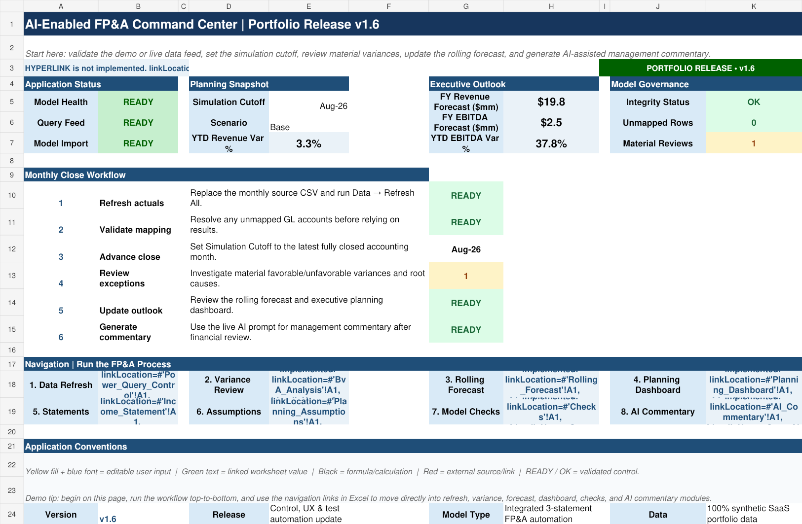
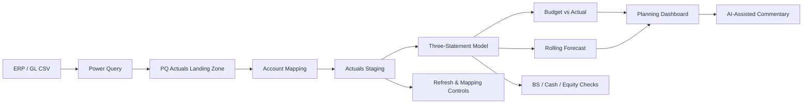
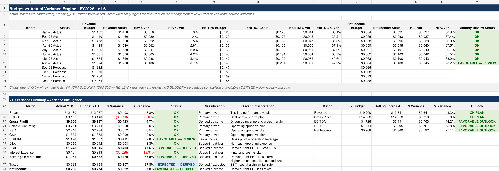
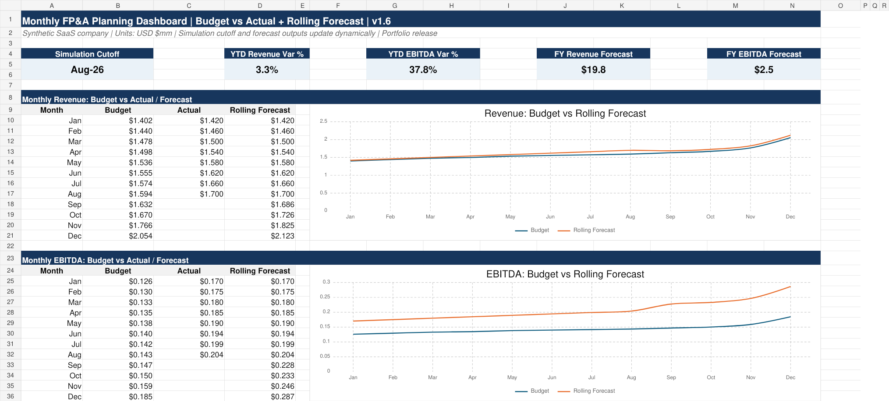
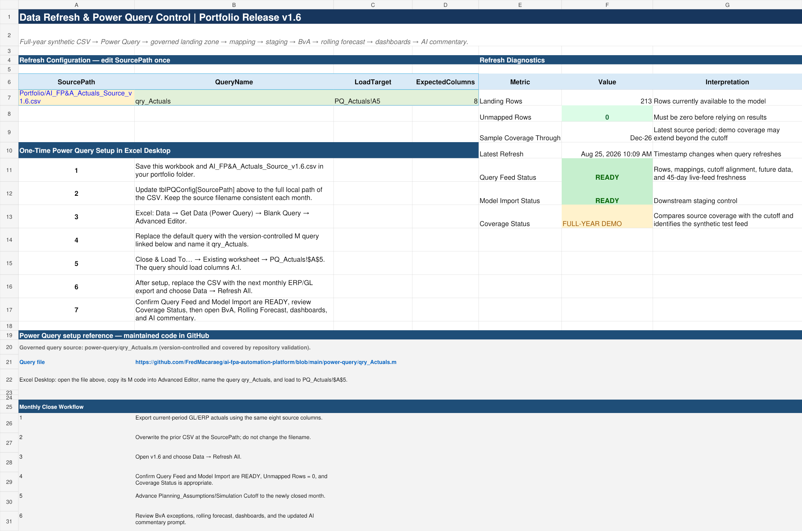

# AI-Enabled FP&A Automation Platform

> **Portfolio project using entirely synthetic financial data.** No employer, client, customer, or confidential information is included.

An Excel-based FP&A application that connects a governed actuals-ingestion workflow to an integrated three-statement model, Budget vs. Actual analysis, rolling forecasts, executive dashboards, financial controls, and AI-assisted management commentary.

## Why I Built This

FP&A teams often spend significant time moving data between exports, spreadsheets, variance files, forecast models, and management reporting. This project explores how that workflow can be consolidated into one controlled Excel application while preserving the transparency and auditability finance teams expect.

The design objective was not to make Excel "look like software." It was to build a finance workflow in which **data ingestion, validation, financial modeling, planning, reporting, and AI-assisted analysis operate as one connected process**.

## 60-Second Demo Flow

1. Replace the sample ERP/GL-style CSV with the latest actuals export.
2. Refresh the Power Query landing zone.
3. Confirm **0 unmapped rows** and **READY** import status.
4. Advance the **Close Through** month.
5. Review material Budget vs. Actual exceptions.
6. See remaining months reforecast automatically.
7. Review updated Revenue, EBITDA, liquidity, and earnings outlooks.
8. Use the live model outputs to generate an FP&A management-commentary prompt for generative AI.

## Application Architecture

## Core Capabilities

| Capability | What the Model Demonstrates |
|---|---|
| Power Query actuals workflow | Repeatable ingestion of ERP/GL-style source data |
| Governed staging layer | Data typing, normalization, period detection, mapping controls |
| Account mapping | Financial-statement classification with unmapped-account exceptions |
| Integrated three-statement model | Income Statement, Balance Sheet, and Cash Flow linkage |
| Scenario planning | Base / Upside / Downside operating assumptions |
| Budget vs. Actual | Monthly and YTD variance analysis with materiality thresholds |
| Variance intelligence | Favorable / unfavorable / derived classifications and driver interpretation |
| Rolling forecast | Closed months use actuals; future periods reforecast from current performance |
| Executive dashboards | Revenue, EBITDA, cash, FCF, and planning outlook visualization |
| Financial controls | Balance Sheet, cash tie, equity roll-forward, refresh, and mapping checks |
| AI-assisted FP&A | Structured management-commentary prompt generated from live model outputs |

## Screenshots

### Budget vs. Actual and Variance Intelligence

### Monthly Planning Dashboard

### Power Query / Refresh Governance

## Model Governance

The application is designed so a successful refresh is not treated as sufficient evidence that the model is ready for management use. It separately checks:

- Source rows landed successfully
- New GL accounts are mapped
- Latest accounting period is present
- Staging layer is ready
- Balance Sheet balances
- Cash Flow ending cash ties to the Balance Sheet
- Equity roll-forward ties
- Material variances requiring management review are surfaced

For example, **Unmapped Rows = 0** displays as green on the Control Center; one or more unmapped rows becomes a blocking red control.

## Rolling Forecast Methodology

The monthly rolling forecast separates closed periods from future periods using a **Close Through** control.

For forecast months, the model uses current YTD performance to update the remainder of the year rather than simply copying the original budget. Key logic includes:

- Revenue realization relative to YTD budget
- Current gross-margin performance plus forecast adjustment
- Operating-expense run rates as a percentage of revenue
- Trailing interest-expense run rate
- Taxes recalculated from forecast earnings before tax

This allows the full-year outlook to update as actual months are closed.

## AI-Assisted FP&A Layer

The current release keeps Excel as the controlled financial engine and uses AI downstream of validated outputs.

The `AI_Commentary` module assembles model results into a structured prompt that asks generative AI to:

- Explain material Budget vs. Actual variances
- Separate root causes from downstream derived impacts
- Identify operating leverage
- Surface margin, liquidity, and earnings risks
- Draft concise management commentary
- Suggest questions management should investigate

This architecture intentionally avoids asking AI to replace financial controls or become the source of truth for calculated results.

## Files

- [`model/AI_FP&A_Three_Statement_Model_v1.5.1.xlsx`](model/AI_FP&A_Three_Statement_Model_v1.5.1.xlsx) - portfolio-release Excel application
- [`sample-data/AI_FP&A_Actuals_Source_v1.5.csv`](sample-data/AI_FP&A_Actuals_Source_v1.5.csv) - synthetic ERP/GL-style actuals source
- [`documentation/FP&A_Automation_Case_Study.pdf`](documentation/FP&A_Automation_Case_Study.pdf) - concise project case study
- [`RELEASE_NOTES.md`](RELEASE_NOTES.md) - development history and release notes

- [`pricing-model/sample-pricing-sheet/`](pricing-model/sample-pricing-sheet/) - reusable interview pricing model with a quote builder, deal-desk guardrails, portfolio metrics, testing notes, and Apps Script automation\n\n## Running the Model

The workbook opens with synthetic demonstration data already populated so reviewers can explore the model without configuring a local data connection.

To test the refresh workflow in Excel Desktop:

1. Download the workbook and sample CSV into the same local portfolio folder.
2. Open `Power_Query_Control`.
3. Update the `SourcePath` parameter to the local CSV path.
4. Create the `qry_Actuals` Power Query using the included M code.
5. Load the query to `PQ_Actuals!A5` as instructed in the workbook.
6. Use **Refresh All** for subsequent source-file updates.

The Power Query connection is a one-time local setup because filesystem permissions and file paths are machine-specific.

## Financial Modeling Conventions

The workbook follows common financial-modeling color conventions:

- **Blue text** - hardcoded/user inputs
- **Green text** - links to other worksheets
- **Black text** - formulas/calculations
- **Red text** - external source/link references
- **Yellow fill** - key assumptions or cells requiring user attention

## Development History

The project was built iteratively to mirror a real product-development cycle:

- **v1.0** - integrated three-statement forecasting model
- **v1.1** - automated actuals import and staging architecture
- **v1.2** - Budget vs. Actual and rolling forecast engine
- **v1.2.1** - favorable/unfavorable variance intelligence and derived-driver logic
- **v1.3** - Power Query refresh workflow and refresh governance
- **v1.4** - application-style Control Center and operating workflow
- **v1.5** - portfolio-release UX, documentation, and demo flow
- **v1.5.1** - final usability and control-status polish

## Skills Demonstrated

`FP&A` · `Financial Modeling` · `Three-Statement Modeling` · `Excel` · `Power Query` · `Budgeting` · `Forecasting` · `Variance Analysis` · `Scenario Planning` · `Management Reporting` · `Data Governance` · `Generative AI` · `Workflow Automation`

## Resume Summary

> Built an AI-enabled FP&A automation platform in Excel integrating Power Query-based ERP/GL ingestion, automated account mapping and staging, three-statement forecasting, Budget vs. Actual variance analysis, rolling forecasts, executive dashboards, financial controls, and AI-assisted management commentary.

## Disclaimer

This is an independent portfolio project created solely to demonstrate financial modeling, FP&A, automation, data-governance, and AI-assisted workflow design. All companies, accounts, transactions, and financial results in the project are fictional and synthetic.